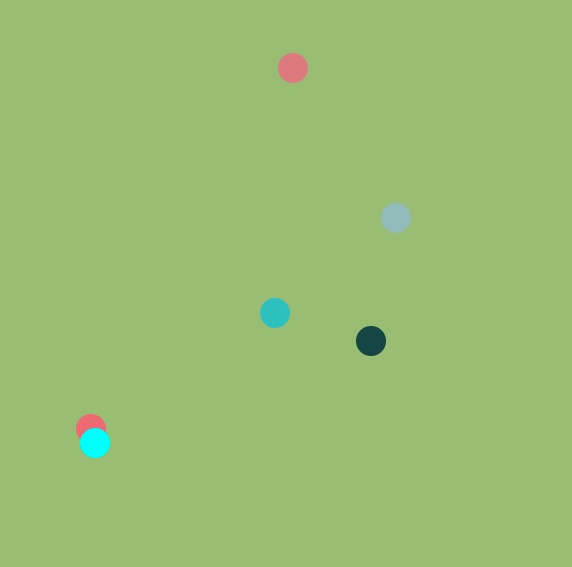

## experimenting with building a browser-based realtime multiplayer game with p5.js and socket.io.

> Each Dot is a player's character. A player can move his character by pressing the arrow keys. The movement is synchronized in real time.

[This app is deployed on heroku](https://evening-garden-47163.herokuapp.com/)

I thought that there would be a lot of interesting challenges to build a realtime multiplayer game. This project was for me to experiment with how such a system can be implemented with optimization (especially state synchronization between clients) in mind.

Technologies used
---
- Front-end
  - React
  - Typescript
  - P5.js
  - WebSocket
- Back-end
  - Express
  - Typescript
  - WebSocket

